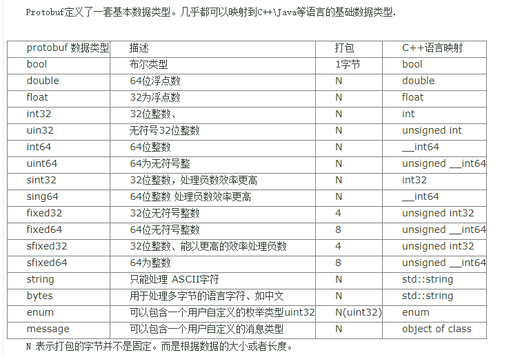

## Google protobuf使用技巧和经验

Google protobuf是非常出色的开源工具，在项目中可以用它来作为服务间数据交互的接口，例如rpc服务、数据文件传输等。protobuf为proto文件中定义的对象提供了标准的序列化和反序列化方法，可以很方便的对pb对象进行各种解析和转换。以下是我总结的protobuf使用技巧和经验，分享给大家。由于公众号尚未开通评论功能，抱歉暂时还不能评论交流。

### 技巧1:使用optional而不是required字段。

protobuf的可选字段optional是一个很巧妙的设计，optional字段是可选的，一个optional字段存在与否都不影响proto对象的序列化和反序列化，利用它可以实现数据协议的向后兼容和向前兼容，即以后增加新的字段，或弃用（注意这里是弃用而不是删除）旧字段都不需要修改代码。 

相比optional字段，requried字段要求字段必须存在，否则会导致proto解析失败。一旦某个字段被设计为requried类型，将来随着业务的快速发展可能会成为负担，因此在使用requried类型时一定要慎重。 

### 技巧2:使用bytes而不是string字段。

这个技巧要感谢身边好同事的建议和提醒，protobuf的bytes和string都能表示字符串，但是string类型会对字符串做utf8格式校验，而bytes不会，因此使用bytes的编解码效率更高。

### 技巧3:尽可能只维护一份proto文件。

世界上唯一不变的事情就是永远在发生变化，精心设计好的proto文件也会随着业务发展而改变。因此，工程中不提倡拷贝分发proto文件，而应通过提供git地址的方式只维护一份proto文件。 

### 技巧4:尽可能减少对其他proto文件的依赖。

proto应尽量独立，在某些编程语言如lua中是不支持proto中嵌套其他proto这种方式的，需要手动修改以剔除外部proto依赖，或采用其他办法解决。另外，减少对其他proto文件的依赖也有利于对proto的查看和理解。 

### 技巧5:利用开源工具实现proto和json的转换。

protobuf的二进制可读性不好，远不如json的可读性，工程中有很多地方都会涉及proto和json之间的转换。假如你手头上有一个很好用的json开发接口，现在要实现proto和json之间的相互转换，一定要抵制住造轮子的冲动，而应该去找找json2pb这样的开源工具。开源工具只需要几行代码就能搞定这样的需求，又好又快，既能提高工作效率，又可以保证质量。 

### 更多技巧: 

网上还有一些很好的关于protobuf的文章，例如protobuf和thrift之间的优缺点对比，protobuf的int压缩设计，protobuf的使用例子，以及lua中解决proto文件嵌套其他proto文件的解决方法等等。学无止境，唯有一生勤勉。 

## 深度好文

- [Protobuf消息设计原则(值得借鉴)](https://blog.csdn.net/wo_Niu123/article/details/80462493)

- [图文分析：如何利用Google的protobuf，来思考、设计、实现自己的RPC框架](https://www.163.com/dy/article/G8JO3BI60511FQO9.html)

- [C++使用protobuf实现序列化与反序列化](https://zhuanlan.zhihu.com/p/425528252)

- [高并发之protobuf通信协议设计|c/c++|linux|服务器开发(1)](https://www.zhihu.com/zvideo/1375819094705557505)

- [c++后端绕不开的7个开源项目，每一个源码值得深入研究(1)](https://www.zhihu.com/zvideo/1433454379010043904)

## probobuf内存释放

```cpp
package proto;
 
message SubItem
{
	required int32 id = 1;
	required int32 type = 2;
	required int32 value = 3;
}
 
message ConfigItem
{
	repeated SubItem items = 1;
}

#include<memory>
#include"client.pb.h"
 
using std::shared_ptr;
 
void readCfg_verson1()
{
	proto::ConfigItem config;
	for ( int idx = 0; idx < 1000; idx++ )
	{
		auto item = config.add_items();
		item->set_id(idx);
		item->set_type(idx);
		item->set_value(idx);
	}
}
 
void readCfg_version2()
{
	proto::ConfigItem *pconfig = new proto::ConfigItem;
	for ( int idx = 0; idx < 1000; idx++ )
	{
		auto item = pconfig->add_items();
		item->set_id(idx);
		item->set_type(idx);
		item->set_value(idx);
	}
	delete pconfig;
}
 
class Foo
{
public:
 
	Foo():pconfig_(new proto::ConfigItem){}
 
	shared_ptr<proto::ConfigItem> pconfig_;
 
	void readCfg_version3()
	{
		for ( int idx = 0; idx < 1000; idx++ )
		{
			auto item = pconfig_->add_items();
			item->set_id(idx);
			item->set_type(idx);
			item->set_value(idx);
		}
	}
};
 
int main(void)
{
	//1.protobuf对象作为栈对象自动析构
	readCfg_verson1();
 
	//2.protobuf对象堆对象使用delete手动析构
	readCfg_version2();
 
	//3.protobuf对象作为成员变量借用shared_ptr的reset()接口调用析构函数
	Foo* proom = new Foo();
	proom->readCfg_version3();
 
	//千万注意：使用protobuf自带的Clear()函数,相当于对C数组进行memset操作,跟STL容器的clear()接口作用不一样
	proom->pconfig_->Clear();
 
	//正确做法：//借助智能指针shared_ptr的reset()接口调用析构函数
	proom->pconfig_.reset(new proto::ConfigItem);
 
	//todo ...
 
	return 0;
}
```