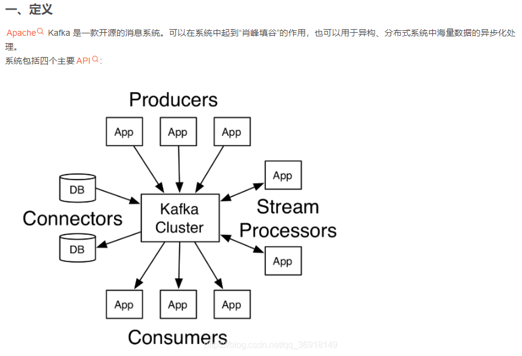

一、定义
Apache Kafka 是一款开源的消息系统。可以在系统中起到“肖峰填谷”的作用，也可以用于异构、分布式系统中海量数据的异步化处理。
系统包括四个主要API:

Producer API
允许一个应用推送流记录通过一个或多个Kafka topics ；
Consumer API
允许一个应用订阅一个或多个topics 并且处理这些流记录；
Streams API
允许一个应用作为一个流处理者，通过topics 输入或输出流数据 ；
Connector API
绑定并运行 Producer 或 Consumer 连接Kafka topics 到 到已经存在的系统或存储上；
二、功能介绍
1) Topics and log
Topic 是发布记录的类别或订阅源名称。Kafka 的topic 会关联用户；一个topic 可以有 0个或多个Consumer 订阅写入它的数据。
对于每个topic ，kafka 集群都会维护一个分区日志，如下图：

每个分区都是一个有序的， 不可变的记录序列， 不断附加到结构化的提交日志中。 分区中的记录每个都被分配一个称为偏移的顺序ID号，它唯一标识分区中的每条记录。
Kafka 集群可以持久的保存所有已发布的记录-无论它们是否被消费-可以易配置保留期限。
每个consumer 会保留消费者在日志中消费的偏移或位置。通常消费者在读取记录的时候会线性提高偏移量，同时消费者也可以按照自己喜欢的顺序消费记录。

Kafka 三层消息框架：
第一层：主题层，每个主题可以配置N个分区，每个分区可以配置M个副本。
第二层：分区层，每个分区的M个副本， 只能有一个lender副本，其对外提供服务，其它M-1 个副本是 追随者副本，只是提供数据冗余之用（客户端只会与分区中的leader副本进行交互）。
第三层：消息层，分区中包含若干条消息，每条消息的位移从0开始，依次递增。

2）Distribution（消息分配）
日志的分区分布在Kafka 集群中的服务器上，每台服务器都可以处理请求数据。每个分区都在可配置数量的服务器上进行复制，以实现容错。
每个分区只有一个服务器充当“leader”，0个或多个服务器充当“followers”，leader 节点处理分区所有的记录读取和写入，followers节点 复制 leader 节点 的数据。 如果 leader 节点 异常，其中一个 followers 节点会被选举为 leader 节点。每个服务器都可以充当某些分区的 leader 节点 和其它服务器的 followers 节点，因此负载均衡在集群中得到很好的平衡。

3）Geo-Replication（异地复制）
Kafka MirrorMaker为您的群集提供地理复制支持。使用MirrorMaker，可以跨多个数据中心或云区域复制数据。您可以在主动/被动方案中使用它进行备份和恢复; 或者在主动/主动方案中，使数据更接近用户，或支持数据位置要求。

4）Producers
生产者将数据发布到他们选择的主题。生产者负责选择分配给主题中哪个分区的记录。这可以通过循环方式完成，只是为了平衡负载，或者可以根据一些语义分区功能（例如基于记录中的某些键）来完成。

5）Consumers
消费者使用消费者组名称标记自己，并且发布到主题的每个记录被传递到每个订阅消费者组中的一个消费者实例。消费者实例可以在单独的进程中，也可以在不同的机器。
如果所有使用者实例具有相同的使用者组，则记录将有效地在使用者实例上进行负载平衡。
如果所有消费者实例具有不同的消费者组，则每个记录将广播到所有消费者进程。

两个服务器Kafka群集，托管四个分区（P0-P3），包含两个使用者组。消费者组A有两个消费者实例，B组有四个消费者实例。
在Kafka中实现消费的方式是通过在消费者实例上划分日志中的分区，以便每个实例在任何时间点都是分配的“公平份额”的独占消费者。维护组中成员资格的过程由Kafka协议动态处理。如果新实例加入该组，他们将从该组的其他成员接管一些分区; 如果实例死亡，其分区将分发给其余实例。分区实现了Kafka 的高并发。

6）Guarantees（可靠性）
生产者发送到特定主题分区的消息将按其发送顺序附加。也就是说，如果记录M1由与记录M2相同的生产者发送，并且首先发送M1，则M1将具有比M2更低的偏移并且在日志中更早出现。
消费者实例按照它们存储在日志中的顺序查看记录。
对于具有复制因子N的主题，我们将容忍最多N-1个服务器故障，而不会丢失任何提交到日志的记录。
三、实践应用
1） Kafka 作为消息系统
通用消息系统中有两种消息模型：队列 和 发布-订阅 。

队列：队列中的数据被一个消费节点读取。它的优势在于允许在多个消费者实例上划分数据处理。缺点是，队列不支持多租户，多个实例情况下无法读取被其它实例消费的记录。

发布-订阅：记录被广播给所有消费者，允许将数据广播到多个消费者实例。

消息顺序性：在通用队列的模式里，服务器上按顺序保存记录，如果有多个消费者从队列中消费，则服务器按存储顺序分发记录，但消息是异步传递给消费者的，
因此他们可能会存在不同消费者上的无序传送。

消息传递系统通常通过具有“独占消费者”的概念来解决这个问题，该概念只允许一个进程从队列中消耗，但这当然意味着处理中没有并行性。

kafka 通过在主题中具有并行性概念 - 分区 - ，Kafka能够在消费者流程池中提供订购保证和负载平衡。这是通过将主题中的分区分配给使用者组中的使用者来实现的，以便每个分区仅由该组中的一个使用者使用。通过这样做，我们确保使用者是该分区的唯一读者并按顺序使用数据。由于有许多分区，这仍然可以平衡许多消费者实例的负载。但请注意，消费者组中的消费者实例不能超过分区。

2）Kafka作为存储系统
任何允许发布与消费它们分离的消息的消息队列实际上充当了正在进行的消息的存储系统。Kafka的不同之处在于它是一个非常好的存储系统。

写入Kafka的数据将写入磁盘并进行复制以实现容错。Kafka允许生产者等待确认，以便在完全复制之前写入不被认为是完整的，并且即使写入的服务器失败也保证写入仍然存在。

磁盘结构Kafka很好地使用了规模 - 无论服务器上有50 KB还是50 TB的持久数据，Kafka都会执行相同的操作。

由于认真对待存储并允许客户端控制其读取位置，您可以将Kafka视为一种专用于高性能，低延迟提交日志存储，复制和传播的专用分布式文件系统。

3）Kafka用于流处理
仅仅读取，写入和存储数据流是不够的，目的是实现流的实时处理。

在Kafka中，流处理器是指从输入主题获取连续数据流，对此输入执行某些处理以及生成连续数据流以输出主题的任何内容。

例如，零售应用程序可能会接收销售和发货的输入流，并输出重新排序流和根据此数据计算的价格调整。

可以使用生产者和消费者API直接进行简单处理。但是，对于更复杂的转换，Kafka提供了完全集成的Streams API。这允许构建执行非平凡处理的应用程序，这些应用程序可以计算流的聚合或将流连接在一起。

此工具有助于解决此类应用程序面临的难题：处理无序数据，在代码更改时重新处理输入，执行有状态计算等。

流API构建在Kafka提供的核心原语上：它使用生产者和消费者API进行输入，使用Kafka进行有状态存储，并在流处理器实例之间使用相同的组机制来实现容错。

四、名词解释
消息：Record。Kafka是消息引擎，这里的消息就是Kafka处理的主要对象。
主体：Topic。主题就是承载消息的逻辑容器，在实际应用中多用于区分具体业务。
消息位移：Offset。表示分区中每条消息的位置信息，是一个单调递增不变的值。
副本：Replica。Kafka中一条消息能够被拷贝到多个地方以提供数据冗余，这些地方就是所谓的副本。副本还分为领导者副本和追随者副本，各自有不同的角色划分。副本是在分区层级下的，即每个分区可配置多个副本实现高可用。
生产者：Producer 。 向主题发布新消息的应用程序。
消费者：Consumer。从主题订阅新消息的应用程序。
消费者位移：Consumer Offset 。表示消费者消费进度，每个消费者都有自己的消费者位移。
消费者组：Consumer Group 。多个消费者实例共同组成的一个组，同时消费多个分区实现高吞吐。
重平衡：Rebalance。消费者组内某个消费者实例挂掉后，其它消费者实例自动重新分配订阅主题分区的过程。Rebalance 是kafka
消费者端实现高可用的重要手段。
————————————————
版权声明：本文为CSDN博主「我傲故我狂」的原创文章，遵循CC 4.0 BY-SA版权协议，转载请附上原文出处链接及本声明。
原文链接：https://blog.csdn.net/qq_36918149/article/details/98471761